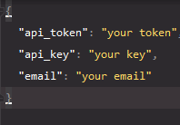
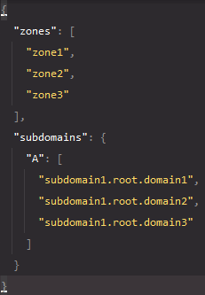

# recorder
[](https://www.codefactor.io/repository/github/cla6shade/recorder)

Cloudflare DNS Record Updater for devices that are dynamically assigned ip via dhcp server(e.g. AWS EC2 Instance)

# How to run
```shell
git clone https://github.com/cla6shade/recorder.git
./start.sh
```


# Setup
1. Run program to generate setup files(auth.json, domains.json)
2. [Click Here](https://dash.cloudflare.com/profile/api-tokens) and copy your Global API Key. Paste it in the value of api_key in auth.json
3. Follow these steps
   1. Hit 'Create Token'
   2. Hit 'Use Template'
   3. <b>DO NOT</b> modify anything in 'Permissions' tab
   4. Set values for 'Zone Resources': Include, All zones from Account, <i>Your Email</i>'s Account
   5. Hit 'Continue to Summary'
   6. Create your token
   7. Copy your generated token and paste into the value of api_token in auth.json
4. Go to the page of the domain you want to update and copy <b>Zone ID</b> in API Tab, paste into values of zones in domains.json.
Multiple zones can be accepted as an array.
5. Put your subdomain as full form into the value of "subdomains > A" in domains.json

The Examples of setting files are here



# TODO
- Automatically check ip address in domain record and update periodically
- Run as service in various operating systems
- Modifiable TTL values in domain settings